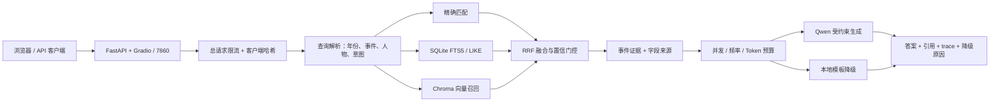

# 史鉴 RAG

面向历史学习的可溯源智能问答系统。项目使用 FastAPI、Gradio、SQLite FTS5、Chroma、RRF 与 Qwen 构建混合检索链路；模型不可用时自动返回带引用的本地证据回答。


> 数据集包含 100 条项目整理的教学事件。`memory_tip` 是项目原创记忆方法，不是史料结论。来源目录当前是自动建立的候选映射，须由人工逐字段核对后才计为“已审核”；本项目不能替代教材、论文或权威史料。

<p align="center">
  
  
</p>

[查看 14 秒问答与拒答演示视频](docs/shijian-rag-demo.webm)

## 在线演示状态

ModelScope Docker 创空间与 Hugging Face Docker Space 的部署配置已经就绪，但公开 URL 尚未发布。只有以下发布门禁全部通过后才会在这里填写真实地址：

- 100 个事件完成签名审核，20 个重点事件完成双来源核对；
- 80 条独立人工问题全部由人工撰写并签名；
- 人工集指标达到门禁，在线冒烟与五路并发测试通过。

当前仓库不会用目标值或空白人工集冒充实测结果。

## 核心能力

- 年份、事件名和人物精确匹配，SQLite FTS5/LIKE 全文召回，Chroma 向量召回，RRF 融合排序。
- 返回事件级引用及真实来源元数据：标题、发布机构、URL、权威等级与支持字段。
- 无检索证据时明确拒答；密钥缺失、模型超时、供应商限流、并发上限或每日预算耗尽时自动降级。
- FastAPI 与 Gradio 在同一进程、同一索引上运行：根路径是 UI，`/api/v1/qa` 是接口，`/docs` 是 OpenAPI。
- 公网模式默认每 IP 每分钟 30 个总请求、6 个模型调用，最多 2 个并发模型调用，每日 50,000 Token。
- 日志只记录加盐哈希后的客户端标识，不保存原始 IP。

## 系统架构



详细设计见 [docs/architecture.md](docs/architecture.md)。

## 实测结果

自动回归集由项目事件字段派生，只用于防回归，不代表开放域能力。2026-07-22 在本机、关闭 Qwen、使用离线哈希向量的结果：

| 指标 | 规则/LIKE 基线 | 混合检索 |
| --- | ---: | ---: |
| 样本数 | 321 | 321 |
| Hit@5 | 99.68% | **100%** |
| MRR@5 | 98.95% | **99.84%** |
| 精确年份/名称 Recall@1 | — | **100%** |
| 无答案拒答准确率 | 90% | **100%** |
| 引用覆盖率 | — | **100%** |
| 规则关键事实支持率 | — | **100%** |
| 本地检索 P95 | — | **7.824 ms** |

完整结果见 [evaluation/REPORT.md](evaluation/REPORT.md)。独立人工集当前为 `80 draft / 0 completed`，所以没有人工指标；完成后结果写入 `evaluation/HUMAN_REPORT.md`。

## 快速启动

要求 Python 3.11–3.13。

```bash
python -m venv .venv
# Windows: .venv\Scripts\activate
# macOS/Linux: source .venv/bin/activate
pip install -e ".[dev]"

python -m scripts.check_evidence
python -m scripts.init_database
python -m scripts.build_index --provider hash
python -m scripts.serve
```

访问：

- UI：`http://127.0.0.1:7860/`
- OpenAPI：`http://127.0.0.1:7860/docs`
- 健康检查：`http://127.0.0.1:7860/healthz`
- 部署就绪检查：`http://127.0.0.1:7860/readyz`
- 版本与证据统计：`http://127.0.0.1:7860/api/v1/meta`

`/healthz` 的 `ok/degraded` 返回 200，数据库不可用返回 503；`/readyz` 只在数据库和向量索引均可用时返回 200，Qwen 是否配置不影响部署就绪状态。

## API 示例

```bash
curl -X POST http://127.0.0.1:7860/api/v1/qa \
  -H "Content-Type: application/json" \
  -d '{"question":"五四运动有什么影响？","history":[]}'
```

关键响应字段：

```json
{
  "answer": "... [E1]",
  "citations": [
    {
      "ref": "E1",
      "name": "五四运动",
      "source_title": "兼容字段",
      "source_url": "兼容字段",
      "sources": [
        {
          "title": "五四运动简介",
          "publisher": "中华英烈网（共产党员网供稿）",
          "url": "https://...",
          "authority_level": "A",
          "supported_fields": ["summary", "detail", "influence", "exam_points"]
        }
      ]
    }
  ],
  "retrieval_mode": "exact_name",
  "degraded": true,
  "degraded_reason": "api_key_missing",
  "refused": false,
  "trace_id": "..."
}
```

## Qwen 与公网保护

复制 `.env.example` 为 `.env`，只在本地或部署平台的 Secret 中填写 Key：

```dotenv
DASHSCOPE_API_KEY=your-key
USE_LLM=true
PUBLIC_DEMO_MODE=true
CLIENT_HASH_SALT=replace-with-a-random-secret
```

Key 不得写入代码、JSONL、Docker 镜像或 Git 历史。公网保护默认值都可通过 `.env.example` 中的变量覆盖。

## 测试与评测

```bash
python -m scripts.check_secrets
python -m scripts.check_evidence
python -m scripts.validate_human_questions
python -m pytest -q
python -m scripts.run_evaluation --suite regression --enforce
```

人工集完成后执行：

```bash
python -m scripts.validate_human_questions --require-final
python -m scripts.run_evaluation --suite human --enforce
python -m scripts.run_evaluation --suite all --enforce
```

独立人工问题的填写规范见 [evaluation/HUMAN_AUTHORING.md](evaluation/HUMAN_AUTHORING.md)。普通 CI 接受空白草稿槽位；部署与正式 Release 工作流强制要求全部人工题目和证据审核完成。

## Docker

```bash
docker build -t shijian-rag .
docker run --rm -p 7860:7860 -e PORT=7860 shijian-rag
```

镜像在构建阶段生成 SQLite 与 Chroma，不依赖持久磁盘；进程使用固定 UID 1000 的非 root 用户，只向 `storage` 运行目录写入。平台可注入其他 `PORT`。

## ModelScope / Hugging Face 部署

首选 [ModelScope Docker 创空间](https://www.modelscope.cn/docs/studios/docker)，固定公开端口 7860，在运行时环境变量中配置 `DASHSCOPE_API_KEY`、`USE_LLM=true`、`PUBLIC_DEMO_MODE=true`、`RUNTIME_DIR=/mnt/workspace/shijian-rag`。ModelScope 创建与部署需要账户登录及平台要求的实名认证。

若 ModelScope 不可用，工作流回退到 [Hugging Face Docker Space](https://huggingface.co/docs/hub/main/spaces-sdks-docker)。两个平台都只在运行时注入 Secret。

GitHub Actions 部署变量：

- ModelScope：Secret `MODELSCOPE_TOKEN`；Variables `MODELSCOPE_STUDIO_PATH`、`MODELSCOPE_DEMO_URL`。
- Hugging Face：Secret `HF_TOKEN`；Variables `HF_SPACE_ID`、`HF_DEMO_URL`。

部署后运行 `python -m scripts.smoke_deployment <URL> --full-load`，检查 `/readyz`、精确查询、来源 URL、拒答、20 次问答和五路并发。

## 数据、来源与审核

- `data/history_events.jsonl`：100 个稳定事件 ID。
- `data/sources.jsonl`：来源标题、发布机构、URL、类型、等级、访问日期和版权说明。
- `data/event_evidence.jsonl`：事件与来源、字段证据、审核人、审核日期和状态。
- `scripts/build_evidence_candidates.py`：只生成候选映射，不授予“已审核”状态。
- `scripts/check_source_links.py`：每周检查链接；2xx/3xx 通过，403/429 标为人工复核。

只提交引用元数据和必要短摘要，不复制受版权保护的教材或史料全文。正式发布门禁要求 100 个事件均有签名 `verified` 状态。

## 已知局限

- 100 条事件不能覆盖开放域历史问题，最大事件年份为 2001。
- 当前来源映射为待人工核对的候选数据，`verified_event_count` 为 0；不能宣传为完成权威史料审核。
- 80 条人工问题尚未填写，因此只能引用 321 条闭集自动回归结果。
- 离线哈希 Embedding 强调可复现，不等同于通用语义模型。
- 单机内存限流适合演示，不适合多副本生产部署；多副本应改用集中式 Redis 限流和预算账本。

## License

代码使用 [MIT License](LICENSE)。公开数据为项目作者确认可再分发的教学整理内容；第三方来源只保存元数据与链接，各来源内容仍受其原许可和版权约束。
