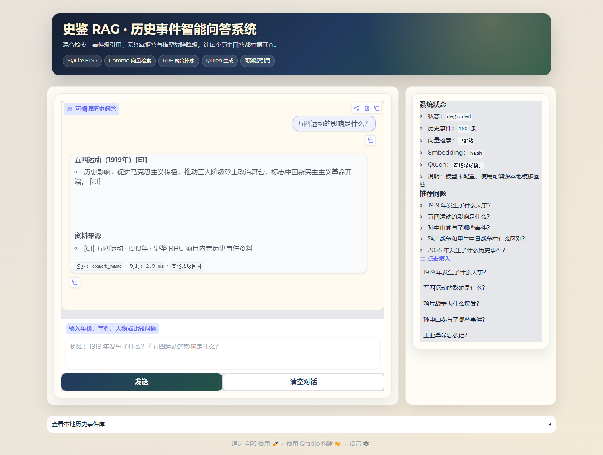
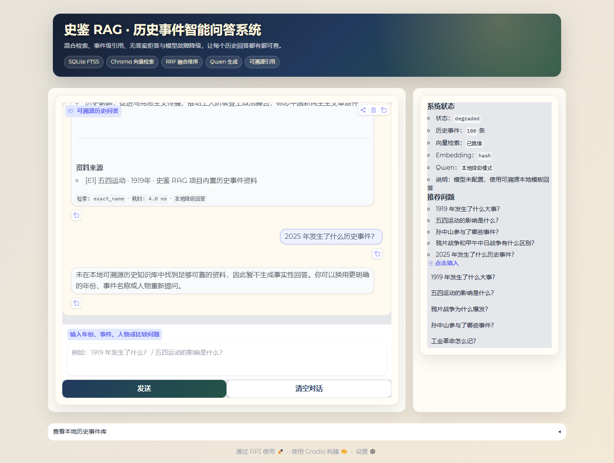
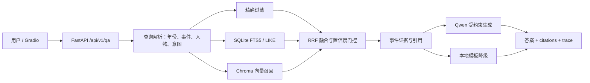

# 史鉴 RAG

面向历史学习的可溯源智能问答系统。项目使用 SQLite FTS5、Chroma 与 RRF 构建混合检索链路，通过 Qwen 生成回答；没有 API Key 或模型调用失败时，会根据检索证据生成本地回答，而不是使用模型记忆补全事实。


> 当前包含 100 条结构化历史事件和 8 条历史学习方法资料。数据为项目整理的教学演示资料，不应替代教材、论文或权威史料。

<p align="center">
  
  
</p>

[查看 14 秒问答与拒答演示视频](docs/shijian-rag-demo.webm)

## 项目亮点

- **混合检索**：年份/事件名精确匹配、人物过滤、SQLite FTS5、LIKE 召回、Chroma 向量召回与 RRF 排序。
- **回答可溯源**：API 同时返回事件级引用、召回结果、匹配通道、trace ID 与耗时。
- **事实边界明确**：显式年份无结果或证据不足时拒答，禁止模型脱离本地资料自由补全。
- **可离线复现**：默认哈希字符 n-gram Embedding，无需下载模型或申请 API Key；可切换 Qwen Embedding。
- **工程化交付**：FastAPI、Gradio、Pytest、离线评测门禁、结构化日志、Docker 和 GitHub Actions。

## 系统架构



详细设计见 [docs/architecture.md](docs/architecture.md)。

## 离线评测结果

执行环境为本机离线哈希向量模式，关闭 Qwen；评测集由 100 条事件数据生成并额外加入语义、比较、追问和 10 条无答案问题。

| 指标 | 原规则/LIKE 基线 | 混合检索 |
| --- | ---: | ---: |
| Hit@5 | 99.68% | **100%** |
| MRR@5 | 98.95% | **99.84%** |
| 无答案拒答准确率 | 90% | **100%** |
| 精确年份/名称 Recall@1 | — | **100%** |
| 引用覆盖率 | — | **100%** |
| 关键事实支持率（规则检查） | — | **100%** |
| 本地检索 P95 | — | **7.13 ms** |

完整结果见 [evaluation/REPORT.md](evaluation/REPORT.md)。这些是 321 条闭集自动评测结果；“关键事实支持率”只检查标注事实是否出现在答案中，不等同于外部专家事实审核。

## 快速开始

要求 Python 3.11–3.13。

```bash
python -m venv .venv
# Windows: .venv\Scripts\activate
# macOS/Linux: source .venv/bin/activate
pip install -e ".[dev]"

python -m scripts.init_database
python -m scripts.build_index --provider hash
```

启动 API：

```bash
uvicorn app.api:app --host 0.0.0.0 --port 8000
```

- OpenAPI：`http://127.0.0.1:8000/docs`
- 健康检查：`http://127.0.0.1:8000/healthz`。`ok`/`degraded` 返回 HTTP 200；数据库不可用的 `unhealthy` 返回 HTTP 503。

启动 Gradio：

```bash
python app.py
```

访问 `http://127.0.0.1:7860`。

## API 示例

```bash
curl -X POST http://127.0.0.1:8000/api/v1/qa \
  -H "Content-Type: application/json" \
  -d '{"question":"五四运动有什么影响？","history":[]}'
```

响应中的关键字段：

```json
{
  "answer": "... [E1]",
  "citations": [{"ref": "E1", "name": "五四运动", "year": 1919}],
  "retrieved_events": [{"name": "五四运动", "matched_by": ["exact_name"]}],
  "retrieval_mode": "exact_name",
  "trace_id": "...",
  "latency_ms": 1.23,
  "degraded": true,
  "refused": false
}
```

## 使用 Qwen

复制 `.env.example` 为 `.env`，填入自己的 DashScope Key：

```dotenv
DASHSCOPE_API_KEY=your-key
USE_LLM=true
QWEN_MODEL=qwen-plus
```

默认仍使用离线 Embedding。若希望使用 Qwen Embedding：

```dotenv
EMBEDDING_PROVIDER=qwen
```

然后重新构建对应索引：

```bash
python -m scripts.build_index --provider qwen
```

API Key 只从环境变量读取；不要写入代码、JSONL 或 Git 提交历史。

## 测试与评测

```bash
python -m pytest -q
python -m scripts.run_evaluation --enforce
python -m scripts.check_secrets
```

`--enforce` 会检查 Hit@5、MRR、精确召回、引用、拒答和 P95 延迟是否达到项目验收阈值。

## Docker

```bash
docker build -t shijian-rag .
docker run --rm -p 8000:8000 shijian-rag
```

容器默认关闭大模型，使用可复现的本地索引，并以固定 UID `10001` 的非 root 用户运行。使用 Qwen 时通过运行参数传入环境变量，切勿把密钥写入镜像。

## 数据与索引

- `data/history_events.jsonl` 是可审查数据源，每个事件使用稳定哈希 ID。
- `python -m scripts.init_database` 使用 UPSERT 同步 SQLite，并重建 FTS5 索引。
- `python -m scripts.build_index` 根据内容哈希增量同步 Chroma，不调用私有 Chroma API。
- `storage/`、旧 SQLite 文件和 Chroma 二进制索引均被 `.gitignore` 排除。

## 项目结构

```text
app/          配置、数据库、查询解析、混合检索、生成、服务和 API
ui/           Gradio 演示界面
data/         可审查 JSONL 数据源
scripts/      初始化、索引、评测和安全检查工具
tests/        单元测试与 API 集成测试
evaluation/   321 条评测集、指标和失败案例
docs/         架构、面试与简历材料
```

## 已知局限

- 当前数据规模仅 100 个事件，最大年份为 2001 年，覆盖面不足以支持开放域历史问答。
- 项目内置事件资料未逐条链接到外部权威史料；引用表示“回答依据了哪条项目资料”，不代表学术引用。
- 离线哈希 Embedding 主要保证可复现，不具备通用语义模型的表示能力。
- 自动评测大部分由同一数据源派生，指标适合回归测试，不应当宣传为开放域准确率。
- 上线公共 Demo 时仍需增加限流、鉴权、内容安全和外部监控。

## 开源协议

代码使用 [MIT License](LICENSE)。公开数据前应确认整理内容拥有再分发权；若未来接入第三方数据集，应分别遵守其许可证。
