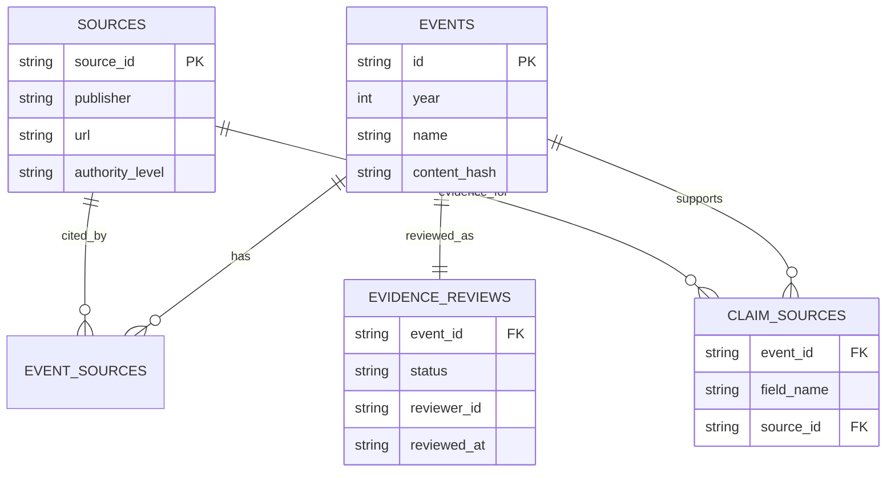

# 系统架构与关键决策

## 请求链路

1. FastAPI 接收问题；Gradio 挂载在同一应用根路径，二者共享一个 `QAService`、数据库和向量索引。
2. 公网保护层对客户端标识做加盐 SHA-256，只保留 16 位哈希；硬请求超限返回 429。
3. 查询解析器识别年份、事件名、人物、原因、过程、影响、比较、记忆和追问。
4. 检索器并行使用精确查询、SQLite FTS5/LIKE 与 Chroma 向量召回，通过 RRF 融合。
5. 低置信或无证据查询拒答；有证据时构造事件和字段来源上下文。
6. Qwen 调用受每客户端频率、全局并发、每日 Token 预算、超时和输出长度控制。
7. 模型不可用或配额不足时，使用同一检索证据生成本地模板回答，并返回 `degraded_reason`。

## 数据与证据

事件 ID 稳定不变。内容哈希包含事件字段、来源元数据、字段证据和审核版本；证据变更会触发对应向量文档更新。SQLite 与 Chroma 均由脚本生成，不提交二进制索引。

## SQLite 与 Chroma 分工

- SQLite：事件主数据、精确过滤、FTS5、来源关系、审核状态和证据版本。
- Chroma：事件及 8 条学习方法文档的向量召回；最终答案引用仍回到 SQLite 的规范化事件与来源。
- RRF：不同检索器的原始分数不可直接比较，RRF 只使用排名，降低跨检索器归一化成本。

## 健康语义

- `/healthz`：数据库缺失为 `unhealthy/503`；向量或模型不可用为 `degraded/200`。
- `/readyz`：数据库和向量索引都就绪才返回 200；模型未配置不阻止容器就绪。
- `/api/v1/meta`：公开版本、事件数、已审核事件数、来源数、证据版本和模型模式。

## 公网保护

默认配置：总请求 30/IP/min，模型调用 6/IP/min，全局模型并发 2，每日 50,000 Token，15 秒超时，最多输出 500 Token。模型频率、并发或预算超限返回带引用的本地回答；只有硬总请求限制返回 429。

预算账本使用运行目录中的 SQLite 单文件，适用于单实例演示。多副本生产部署必须改为 Redis 或其他集中式原子计数器。

## 可信边界

- 检索结果只表示“项目资料中命中”，不表示开放域事实必然正确。
- `candidate` 来源映射不能计为人工审核；只有带审核人和日期的 `verified` 事件计入 `/meta`。
- `memory_tip` 永久标记为 `project_original`，不会绑定为史料事实。
- 321 条自动集是闭集回归；80 条独立人工集完成前不生成也不宣传人工指标。
